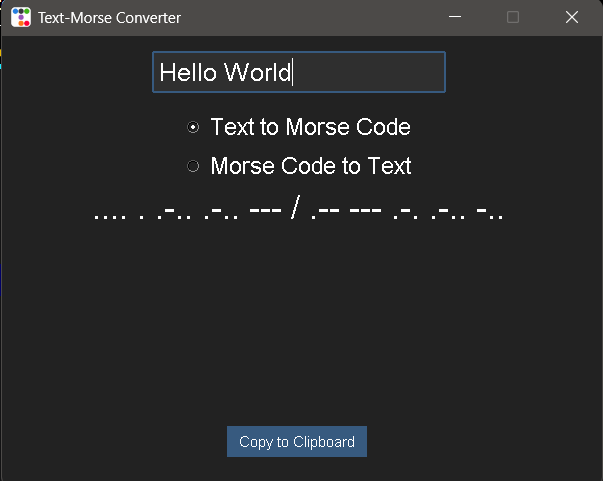

# Text-Morse Converter

# A simple text-morse converter made using python 

This is an exrtremely simple GUI program I built with Python using, ttkbootstrap. 

* Convert Text to Morse Code
* Convert Morse Code to text 
* Signle GUI

### How to Install
If you're something who isn't tech savvy there is "Text-Morse Converter.exe" file which you can 
use to run the program directly on your Windows Computer.

However if you're someone who knows their way around, you can install the required modules using the "requirements.txt" 
file and run the program on your ide

## Find bug?
If you come across a bug, feel free to submit using the tab above.

